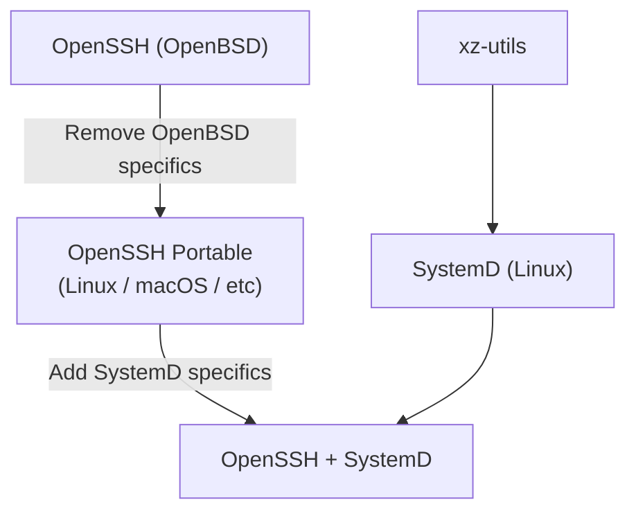

# IFUNC'd up
*Or: How I learned to stop blaming xz-utils for [CVE-2024-3094][nvd]*


## What does GNU IFUNC even do?
It allows you to determine, at runtime, which version of some function you'd
like to use.

### Isn't that just function pointers?
No, actually, it's slower than function pointers, and requires custom tooling in
the compiler and the dynamic loader. Take a look at this:

```console
$ make speed_demo

# Timing speed_demo_ifunc.exe
time -p ./speed_demo_ifunc.exe
real 9.20
user 9.02
sys 0.00

# Timing speed_demo_pointer.exe
time -p ./speed_demo_pointer.exe
real 5.97
user 5.91
sys 0.00
```

So right off the bat, GNU IFUNC is a way to memoize a function's address that is
both less portable and more expensive than regular old function pointers. I'll
give a more [rigorous analysis](#ifunc-performance-overhead) later.

## Overview of CVE-2024-3094
There are tons of good writeups outlining the high level details
of the xz-utils backdoor, like Dan Goodin's [What we know about the xz
Utils backdoor that almost infected the world][goodin1] and Thomas
Roccia's [XZ Outbreak][fr0gger] diagram. For the purposes of this
article, here is a **very coarse** recap:

* Some Linux distros modify OpenSSH to to play nice with SystemD
* SystemD depends on xz-utils
* Ergo, xz-utils ends up in the address space of OpenSSH



## OpenSSH
The inclusion of another library into the address space of OpenSSHd was
not something that the OpenSSH developers anticipated, as evidenced by a
near total lack of discussion on their mailing lists.  The [release
notes][OpenSSH9.8p1] for OpenSSH 9.8 don't even mention CVE-2024-3094.
The only mention in the developer mailing lists is [Re: D-bus
integration][openssh-unix-dev].


## ifunc Performance Overhead
Given that the usual justification for ifunc is performance-related, I wanted to
see how much overhead *ifunc itself* causes. After all, any function worth
optimizing is probably called frequently, so the overhead of the function
invocation is worth acknowledging.

To figure this out, I designed an experiment that would call an *dynamically
resolved* function over and over again in a tight loop.  Take a look at
[`speed_demo_ifunc.c`](speed_demo_ifunc.c) and
[`speed_demo_pointer.c`](speed_demo_pointer.c).  These programs both do the same
work (incrementing a static counter), but the incrementer functions are resolved
in different ways: the former leverages GNU IFUNC, and the latter relies on
plain old function pointers.

Here is the overall logic:

1. Call a resolver function to determine which incrementer to use.
1. Record this answer somewhere (in the GOT, or as a function pointer).
1. Call this incrementer function a few billion times to get an estimate of its
   cost.

As a control, there is also [`speed_demo_fixed.c`](speed_demo_fixed.c) which
does the same incrementer work but without any dynamically resolve functions.
This can be used to get a help estimate what part of the runtime is dedicated to
function invocation vs what part is just doing addition.

The Makefile target `rigorous_speed_demo` makes several runs of each of these
programs and produces some simple statistics about their performance. These
numbers will of course change based on your hardware, but the `fixed` test
should serve as a baseline for comparison.

### Final Results
| TEST    | LOW  | HIGH | AVG   |
|---------|------|------|-------|
| fixed   | 2.93 | 4.20 | 3.477 |
| ifunc   | 9.50 | 10.56| 9.986 |
| pointer | 6.23 | 7.44 | 6.791 |

Granted, ifunc does a lot more than function pointers do, so this is not a fair
comparison. ifunc handles symbol resolution lazily, which makes more sense for
large libraries (like glibc) -- if a library had to resolve all its dynamic
symbols during the loading process, it could cause a measurable performance
penalty even for applications which only need a small portion of those symbols.

But for smaller libraries like xz-utils, there just aren't many symbols that
need to be resolved in this way. Handling any such resolution when the library
is loaded would surely go unnoticed (relative to the cost of loading a library
from disk in the first place).

## Recap


[fr0gger]: https://infosec.exchange/@fr0gger/112189232773640259
[goodin1]: https://arstechnica.com/security/2024/04/what-we-know-about-the-xz-utils-backdoor-that-almost-infected-the-world/
[nvd]: https://nvd.nist.gov/vuln/detail/CVE-2024-3094
[OpenSSH9.8p1]: https://www.openssh.com/releasenotes.html#9.8p1
[openssh-unix-dev]: https://marc.info/?l=openssh-unix-dev&m=171288895109872&w=2
[sourceware]: https://sourceware.org/glibc/wiki/GNU_IFUNC
