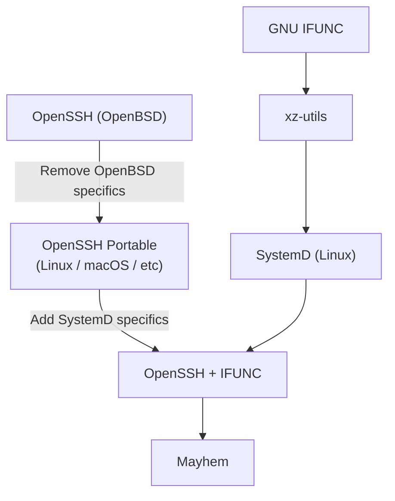
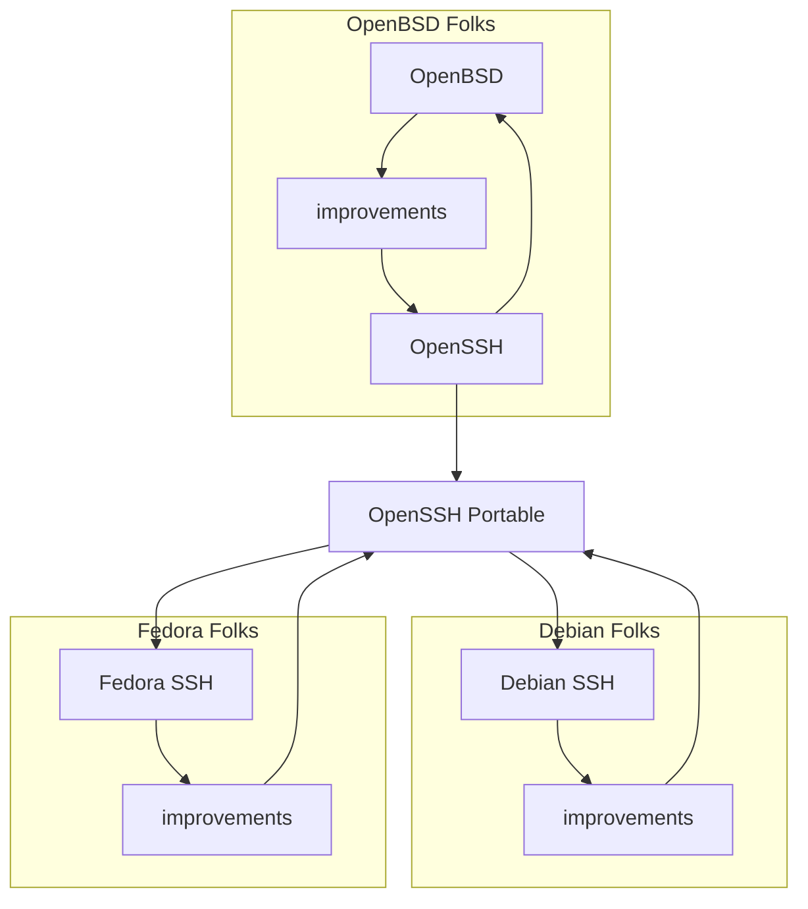
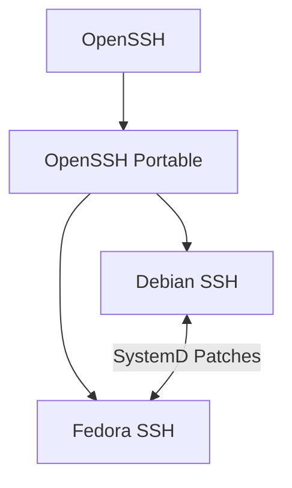

# IFUNC'd up
*Why you should stop blaming xz-utils for [CVE-2024-3094][nvd]*


CVE-2024-3094, more commonly known as "The xz-utils backdoor", was a
near miss for global cybersecurity. Had this attack not been discovered
in the nick of time by [Andres Freund][freund], most of our planet's SSH
servers would have begun granting root access to the party behind this
attack.

Unfortunately, too much analysis has focused on how [malicious
code][JiaT75] made its way into the xz-utils repo.  Instead, I'd like to
argue that two longstanding design decisions in critical open source
software are what made this attack possible: [linking OpenSSH against
SystemD][biebl], and the existence of [GNU IFUNC][sourceware].


## Quick Recap of CVE-2024-3094
There are tons of good writeups outlining the high level details of the
xz-utils backdoor, like Dan Goodin's [What we know about the xz Utils
backdoor that almost infected the world][goodin1] and Thomas Roccia's
[XZ Outbreak][fr0gger] diagram. We don't need to rehash all that here,
so the purposes of this article, here is a **very coarse** recap:

* Some Linux distros modify OpenSSH to depend on SystemD
* SystemD depends on xz-utils, which uses GNU IFUNC
* Ergo, xz-utils ends up in the address space of OpenSSH
* This allows ifunc to modify code in the SSH server



Much of this discussion deals with the intricacies of dynamic linking on
Linux. If you are not already intimately familiar with this, check out
[`dynamic_linking.md`](dynamic_linking.md) for a quick primer.


## Why do Linux Distros modify OpenSSH?
The short answer is that they have to. OpenSSH is developed by the
OpenBSD community, for the OpenBSD community, and they do not give a
flying Fedora about Linux.  The [OpenSSH Portable][mindrot] project is a
best-effort collection of patches which replace OpenBSD-specific
components with generic POSIX components, and some platform-specific
code where applicable. The software supply-chain for SSH ends up looking
something like this in practice:



OpenBSD's version of OpenSSH is upstream from everything else, and most
improvements to it come from within the OpenBSD community. These changes
flow downstream to the OpenSSH Portable project, which attempts to
re-implement new features in ways that aren't specific to OpenBSD. This
is what allows SSH to work on platforms like Linux, macOS, FreeBSD, and
even Windows. 

But it doesn't stop there. Some operating systems apply further
customization beyond what OpenSSH Portable provides. For example, Apple
adds the [`--apple-use-keychain`][keith] flag to `ssh-add` to help it
integrate with the macOS password manager.

In the case of CVE-2024-3094, Fedora and Debian maintained their own
[SystemD patches][biebl] for their forks of OpenSSH in order to fix a
[race condition around `sshd` restarts][schmidt]. So the *actual* supply
chain for SSH began to look like this:



These patches never went into OpenSSH Portable, because the OpenSSH
Portable folks were ["not interested in taking a dependency on
libsystemd"][djmdjm]. And they never went into upstream OpenSSH, because
OpenBSD doesn't have any need to support SystemD.


### Concerns about "Separation of Concerns"
This seems harmless enough, but it's an example of a much larger problem
in Open Source, particularly in Linux: critical components of the
operating system are developed by people who don't know each other, and
don't talk to each other. 

* Did the folks who patched OpenSSH for SystemD know (or care) that
  libsystemd depends on xz-utils?
* Did the SystemD folks know (or care) that xz-utils had begun using
  ifunc?
* Did the OpenSSH folks know (or care) that ifunc was a thing? It's
  certainly not a thing on OpenBSD.

In some sense, this breakdown in communication is a feature of open
source: I can adapt your work to my needs without having to bother you
about it. But it can also lead to a degree of indirection that prevents
critical design assumptions (such as a traditional dynamic linking
process) from being upheld.

The obvious corollary to [Conway's Law][conway] is that if you are
shipping your org chart, you're also shipping the bugs that live in the
cracks of your org chart. No one person or team really made a mistake
here, but with the benefit of hindsight it's clear the attackers
perceived that the left hand of Debian/Fedora SSH did not know what the
right hand of xz-utils was doing.


## What is GNU IFUNC *supposed* do?
It allows you to determine, at runtime, which version of some function
you'd like to use. It does this by giving you to an opportunity to run
**arbitrary code** to influence how the linker resolves symbols.


Suppose you have an application that must run on a wide variety of x86
CPUs.  Depending on the specific features of the current CPU, you may
prefer to use different algorithms for the same task. The idea behind
IFUNC was to allow programs to check for CPU features the first time a
function is called, and thereafter use an implementation that will be
most appropriate for that CPU.

Take a look at [`cpu_demo.c`](code/cpu_demo.c). This file shows the most
common use of IFUNC: it asks the CPU whether or not it supports certain
features, and provides a different *implementation* of a function
depending on what features are supported. In this case, our function
`print_cpu_info` will end up printing either "AVX2 is present" or
"SSE4.2 is present" depending on how ancient your CPU is.

Unfortunately, IFUNC can be used for other purposes, as Sam James
explains in [FAQ on the xz-utils backdoor (CVE-2024-3094)][thesamesam].
You can see an example of this in [`tty_demo.c`](code/tty_demo.c).  This
is a toy program that prints "Hello World!" when its stdout is a file,
but prints that message using green text if its output is a terminal. It
uses IFUNC to load the appropriate implementation when the program
starts.


### Isn't that just function pointers?
Yes, it's like function pointers, but slower:

```console
$ make speed_demo

# Timing speed_demo_ifunc.exe
time -p ./speed_demo_ifunc.exe
real 9.20
user 9.02
sys 0.00

# Timing speed_demo_pointer.exe
time -p ./speed_demo_pointer.exe
real 5.97
user 5.91
sys 0.00
```

I'll give a more [rigorous analysis](#performance-overhead) later in
this document, but for now just understand that using GNU IFUNC incurs a
little extra overhead, even though it exists for the sake of performance
optimizations.


### Can't I accomplish the same thing with `LD_PRELOAD`?
Sortof! GNU IFUNC allows developers to make runtime decisions about
which version of a function is best to use. If you know what decisions
need to be made (and you have a separate copy of your dynamic library
for each case) then you could accomplish the same thing by specifying
the right library with `$LD_PRELOAD` like so:

```bash
#!/bin/bash
if (cat /proc/cpuinfo | grep flags | grep avx2 > /dev/null); then
	LD_PRELOAD=./myfunc_avx2.so ./my_app
else
	LD_PRELOAD=./myfunc_normal.so ./my_app
fi
```

(If you are unfamiliar with `LD_PRELOAD`, check out catonmat's ["A Simple
`LD_PRELOAD` Tutorial"][catonmat].)


## IFUNC is Probably a Bad Idea


GNU IFUNC is difficult to implement, hard to use correctly, and (as an
alleged performance tool) isn't much faster than alternatives. As we've
seen with CVE-2024-3094, it is also a very powerful tool for software
supply-chain attacks.

IFUNC is used extensively within the GNU C Library, and that's probably
fine.  Those are the folks for whom it was originally developed, and
they are closely connected with the compiler and linker teams who
actually implement IFUNC. They are in the best position to understand
the tradeoffs, and there are tons of libc functions that benefit from
CPU-specific implementations. I believe we should consider IFUNC to be
an internal interface for glibc, and limit its use in other
applications.


### It's too Confusing to Use Safely
ifunc is entirely too difficult to use. There are too many [corner
cases][nagy], and the [official documentation][gnu-cfa] is
[scant][sourceware]. This gives users the misleading idea that adopting
ifunc is straightforward.

Even several years after ifunc became available, the advertised
interface [did not work][agner]. GCC developers have called it [a
mistake][odonell] and have considered adding warnings to compensate for
IFUNC's fragility:

> The glibc solutions required to make IFUNC robust are not in place,
> and so we should do what we can to warn users that it might break.

It isn't just IFUNC either. Apple Mach-O has a similar feature called
`.symbol_resolver` which they ["regret adding"][rjmccall].


### It isn't Much Faster than Alternatives
Given that the usual justification for ifunc is performance-related, I
wanted to see how much overhead *ifunc itself* causes. After all, any
function worth optimizing is probably called frequently, so the overhead
of the function invocation is worth acknowledging.

To figure this out, I designed an experiment that would call a
*dynamically resolved* function over and over again in a tight loop.
Take a look at [`speed_demo_ifunc.c`](code/speed_demo_ifunc.c) and
[`speed_demo_pointer.c`](code/speed_demo_pointer.c).  These programs
both do the same work (incrementing a static counter), but the
incrementer functions are resolved in different ways: the former
leverages GNU IFUNC, and the latter relies on plain old function
pointers.

Here is the overall logic:

1. Call a resolver function to determine which incrementer to use.
1. Record this answer somewhere (in the GOT, or as a function pointer).
1. Call this incrementer function a few billion times to get an estimate
   of its cost.

As a control, there is also
[`speed_demo_fixed.c`](code/speed_demo_fixed.c) which does the same
incrementer work but without any dynamically resolve functions.  This
can be used to get a help estimate what part of the runtime is dedicated
to function invocation vs what part is just doing addition.

The Makefile target `rigorous_speed_demo` makes several runs of each of
these programs and produces some simple statistics about their
performance. These numbers will of course change based on your hardware,
but the `fixed` test should serve as a baseline for comparison.

| *Results* | LOW  | HIGH | AVG   |
|-----------|------|------|-------|
| fixed     | 2.93 | 4.20 | 3.477 |
| ifunc     | 9.50 | 10.56| 9.986 |
| pointer   | 6.23 | 7.44 | 6.791 |

What we see here is that ifunc has a not-insignificant overhead compared
to using a plain-old function pointer. On average, on my hardware, it
takes about twice as long to call an ifunc function 2 billion times as
it does to invoke a function pointer 2 billion times.

Does this matter in real life? Absolutely not. Functions that are worth
optimizing are much more expensive than the "increment by one" functions
that we are analyzing here. It is interesting because GNU IFUNC claims
to be a boon for performance.


#### Performance of Other Techniques
There are other techniques which are slower than ifunc. Take a look at the
`super_rigorous_speed_demo`, which brings to other experiments into play:
[`speed_demo_upfront.c`](code/speed_demo_upfront.c) and
[`speed_demo_always.c`](code/speed_demo_always.c).

`speed_demo_upfront.c` behaves similarly to `speed_demo_pointer.c`,
except that it stores the results of the cpu feature checks in global
variables rather than keeping track of a function pointer. This still
requires a "resolver" function to run first to determine which
implementation gets used, based on the value of these global variables.
This technique turns out to be slower than ifunc, but it is also safer
than storing function pointers: whereas function pointers can be set to
arbitrary values, boolean flags cannot. So an attacker able to modify
these variables can make the program *slower*, but cannot make the
program behave *differently*.

`speed_demo_always.c` is designed to be the slowest technique -- it
checks all the necessary CPU features every time an implementation is
needed and picks one on the fly. Curiously, this technique is not
significantly slower than anything else. It is only marginally slower
than ifunc in the case where we have just a single CPU feature to check. 

| TEST    | LOW  | HIGH  | AVG     |
|---------|------|-------|---------|
| fixed   | 5.02 | 5.70  | 5.37    |
| pointer | 6.40 | 7.02  | 6.66    |
| ifunc   | 8.56 | 11.11 | 9.64    |
| upfront | 9.24 | 9.41  | 9.33333 |
| always  | 10.07| 10.56 | 10.2333 |


## Recap


[agner]: https://www.agner.org/optimize/blog/read.php?i=167
[biebl]: https://salsa.debian.org/ssh-team/openssh/-/commit/818791ef8edf087481bd49eb32335c8d7e1953d6
[catonmat]: https://catonmat.net/simple-ld-preload-tutorial
[conway]: https://en.wikipedia.org/wiki/Conway's_law
[djmdjm]: https://github.com/openssh/openssh-portable/pull/251#issuecomment-2027935208
[fr0gger]: https://infosec.exchange/@fr0gger/112189232773640259
[freund]: https://www.openwall.com/lists/oss-security/2024/03/29/4
[gnu-cfa]: https://gcc.gnu.org/onlinedocs/gcc/Common-Function-Attributes.html#index-ifunc-function-attribute
[goodin1]: https://arstechnica.com/security/2024/04/what-we-know-about-the-xz-utils-backdoor-that-almost-infected-the-world/
[jasoncc]: https://jasoncc.github.io/gnu_gcc_glibc/gnu-ifunc.html#relocations-and-pic
[JiaT75]: https://github.com/tukaani-project/xz/commit/cf44e4b7f5dfdbf8c78aef377c10f71e274f63c0
[keith]: https://keith.github.io/xcode-man-pages/ssh-add.1.html#apple-use-keychain
[mindrot]: https://anongit.mindrot.org/openssh.git
[musl]: https://musl.libc.org
[nagy]: https://sourceware.org/legacy-ml/libc-alpha/2015-11/msg00108.html
[nvd]: https://nvd.nist.gov/vuln/detail/CVE-2024-3094
[odonell]: https://gcc.gnu.org/bugzilla/show_bug.cgi?id=70082#c0
[OpenSSH9.8p1]: https://www.openssh.com/releasenotes.html#9.8p1
[openssh-unix-dev]: https://marc.info/?l=openssh-unix-dev&m=171288895109872&w=2
[rjmccall]: https://reviews.llvm.org/D139163#3993795
[schmidt]: https://bugzilla.redhat.com/show_bug.cgi?id=1381997#c4
[sourceware]: https://sourceware.org/glibc/wiki/GNU_IFUNC
[thesamesam]: https://gist.github.com/thesamesam/223949d5a074ebc3dce9ee78baad9e27#design
