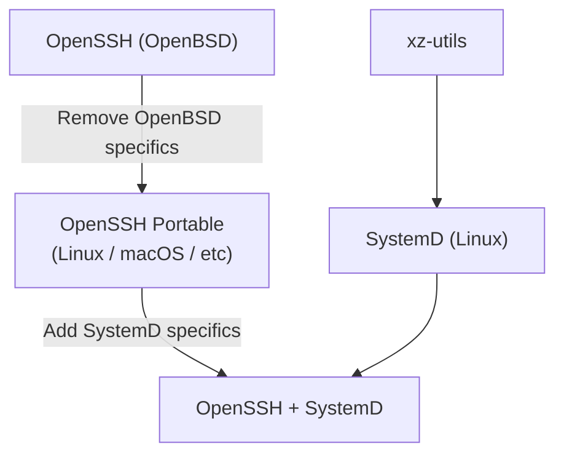

# IFUNC'd up
*Or: How I learned to stop blaming xz-utils for [CVE-2024-3094][nvd]*


## What does GNU IFUNC even do?
It allows you to determine, at runtime, which version of some function you'd
like to use.

### Isn't that just function pointers?
No, actually, it's slower than function pointers, and requires custom tooling in
the compiler and the dynamic loader. Take a look at this:

```console
$ make speed_demo

# Timing speed_demo_ifunc.exe
time -p ./speed_demo_ifunc.exe
real 9.20
user 9.02
sys 0.00

# Timing speed_demo_pointer.exe
time -p ./speed_demo_pointer.exe
real 5.97
user 5.91
sys 0.00
```

So right off the bat, GNU IFUNC is a way to memoize a function's address that is
both less portable and more expensive than regular old function pointers.

## Overview of CVE-2024-3094
There are tons of good writeups outlining the high level details
of the xz-utils backdoor, like Dan Goodin's [What we know about the xz
Utils backdoor that almost infected the world][goodin1] and Thomas
Roccia's [XZ Outbreak][fr0gger] diagram. For the purposes of this
article, here is a **very coarse** recap:

* Some Linux distros modify OpenSSH to to play nice with SystemD
* SystemD depends on xz-utils
* Ergo, xz-utils ends up in the address space of OpenSSH



## OpenSSH
The inclusion of another library into the address space of OpenSSHd was
not something that the OpenSSH developers anticipated, as evidenced by a
near total lack of discussion on their mailing lists.  The [release
notes][OpenSSH9.8p1] for OpenSSH 9.8 don't even mention CVE-2024-3094.
The only mention in the developer mailing lists is [Re: D-bus
integration][openssh-unix-dev].

[nvd]: https://nvd.nist.gov/vuln/detail/CVE-2024-3094
[OpenSSH9.8p1]: https://www.openssh.com/releasenotes.html#9.8p1
[openssh-unix-dev]: https://marc.info/?l=openssh-unix-dev&m=171288895109872&w=2
[sourceware]: https://sourceware.org/glibc/wiki/GNU_IFUNC
