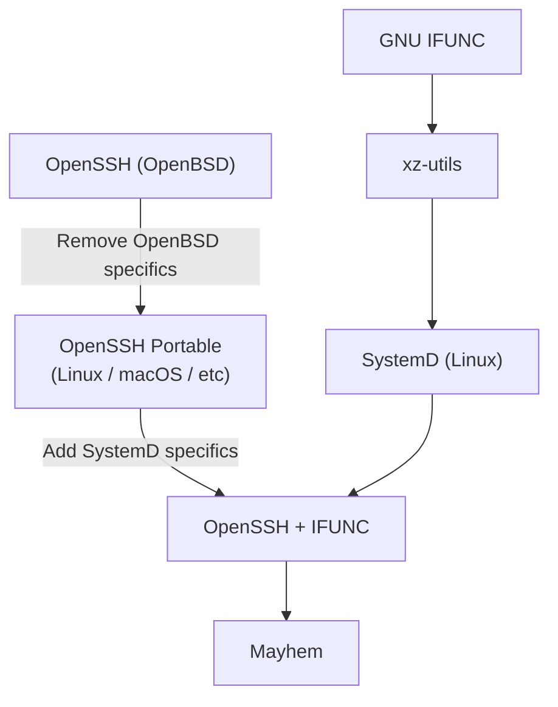
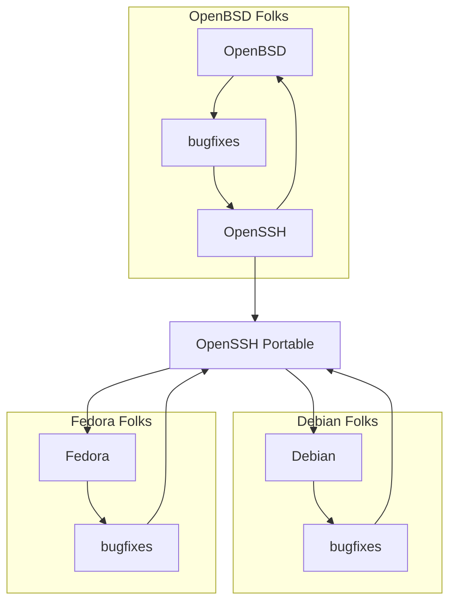

# IFUNC'd up
*Or: How I learned to stop blaming xz-utils for [CVE-2024-3094][nvd]*


## Overview of CVE-2024-3094
There are tons of good writeups outlining the high level details
of the xz-utils backdoor, like Dan Goodin's [What we know about the xz
Utils backdoor that almost infected the world][goodin1] and Thomas
Roccia's [XZ Outbreak][fr0gger] diagram. For the purposes of this
article, here is a **very coarse** recap:

* Some Linux distros modify OpenSSH to depend on SystemD
* SystemD depends on xz-utils, which uses GNU IFUNC
* Ergo, xz-utils ends up in the address space of OpenSSH
* This allows the ifunc resolver to modify any function in OpenSSH



In this writeup, I'd like to argue that GNU IFUNC is the real culprit behind
this attack. It facilitates nearly-arbitrary manipulation of function definitions at
runtime, and can help disguise malicious payloads as performance
optimizations.

## OpenSSH
OpenSSH is developed by the OpenBSD community, for the OpenBSD community, and
they do not give one flying shit about Linux.  The [OpenSSH Portable][mindrot]
project is a best-effort collection of patches which replace OpenBSD-specific
components with generic POSIX components, and some platform-specific code where
applicable. Here's what this ends up looking like in practice:



Don't get me wrong, this setup works really well on the whole! It has provided
Linux users with a reliable SSH server for many years. But my point is that
*design choices* by OpenSSH maintainers are made without respect to the nuances
of other platforms, and it's up to the OpenSSH Portable folks to compensate for
that (for free, out of the goodness of their hearts).

I say all this to point out that OpenBSD does not use SystemD. Their init system
is a suite of shell scripts, and there is no library against which services
could or should link. The notion that someone would need to link OpenSSH against
*other libraries* in order to get it to start probably never crossed the mind of
any single OpenBSD developer. Indeed, there has been nearly zero discussion of
CVE-2024-3094 on their mailing lists, and the [release notes][OpenSSH9.8p1] for
OpenSSH 9.8 don't even mention it.


## What does GNU IFUNC even do?
It allows you to determine, at runtime, which version of some function you'd
like to use.

Suppose you have one application that must run on a wide variety of x86 CPUs.
Depending on the specific features of the current CPU, you may prefer to use
different algorithms for the same task. The idea behind IFUNC was to allow
programs to check for CPU features the first time a function is called, and
thereafter use an implementation that will be most appropriate for that CPU.

Unfortunately, IFUNC can be used for other purposes, as Sam James explains in
[FAQ on the xz-utils backdoor (CVE-2024-3094)][thesamesam].


### Isn't that just function pointers?
Yes, it's like function pointers, but slower:

```console
$ make speed_demo

# Timing speed_demo_ifunc.exe
time -p ./speed_demo_ifunc.exe
real 9.20
user 9.02
sys 0.00

# Timing speed_demo_pointer.exe
time -p ./speed_demo_pointer.exe
real 5.97
user 5.91
sys 0.00
```

I'll give a more [rigorous analysis](#performance-overhead) later in this
document, but for now just understand that using GNU IFUNC incurs a little extra
overhead, even though it exists for the sake of performance optimizations.


### Can't I accomplish the same thing with `LD_PRELOAD`?
Sortof! GNU IFUNC allows developers to make runtime decisions about which
version of a function is best to use. If you know what decisions need to be
made (and you have a separate copy of your dynamic library for each case) then
you could accomplish the same thing by specifying the right library with
`$LD_PRELOAD` like so:

```bash
#!/bin/bash
if (cat /proc/cpuinfo | grep flags | grep avx2 > /dev/null); then
	LD_PRELOAD=./myfunc_avx2.so ./my_app
else
	LD_PRELOAD=./myfunc_normal.so ./my_app
fi
```

(If you are unfamiliar with `LD_PRELOAD`, check out catonmat's ["A Simple
LD_PRELOAD Tutorial"][catonmat].)


## Performance Overhead
Given that the usual justification for ifunc is performance-related, I wanted to
see how much overhead *ifunc itself* causes. After all, any function worth
optimizing is probably called frequently, so the overhead of the function
invocation is worth acknowledging.

To figure this out, I designed an experiment that would call an *dynamically
resolved* function over and over again in a tight loop.  Take a look at
[`speed_demo_ifunc.c`](speed_demo_ifunc.c) and
[`speed_demo_pointer.c`](speed_demo_pointer.c).  These programs both do the same
work (incrementing a static counter), but the incrementer functions are resolved
in different ways: the former leverages GNU IFUNC, and the latter relies on
plain old function pointers.

Here is the overall logic:

1. Call a resolver function to determine which incrementer to use.
1. Record this answer somewhere (in the GOT, or as a function pointer).
1. Call this incrementer function a few billion times to get an estimate of its
   cost.

As a control, there is also [`speed_demo_fixed.c`](speed_demo_fixed.c) which
does the same incrementer work but without any dynamically resolve functions.
This can be used to get a help estimate what part of the runtime is dedicated to
function invocation vs what part is just doing addition.

The Makefile target `rigorous_speed_demo` makes several runs of each of these
programs and produces some simple statistics about their performance. These
numbers will of course change based on your hardware, but the `fixed` test
should serve as a baseline for comparison.

#### Results
| TEST    | LOW  | HIGH | AVG   |
|---------|------|------|-------|
| fixed   | 2.93 | 4.20 | 3.477 |
| ifunc   | 9.50 | 10.56| 9.986 |
| pointer | 6.23 | 7.44 | 6.791 |

Granted, ifunc does a lot more than function pointers do, so this is not a fair
comparison. ifunc handles symbol resolution lazily, which makes more sense for
large libraries (like glibc) -- if a library had to resolve all its dynamic
symbols during the loading process, it could cause a measurable performance
penalty even for applications which only need a small portion of those symbols.

But for smaller libraries like xz-utils, there just aren't many symbols that
need to be resolved in this way. Handling any such resolution when the library
is loaded would surely go unnoticed (relative to the cost of loading a library
from disk in the first place).

## Recap


[catonmat]: https://catonmat.net/simple-ld-preload-tutorial
[fr0gger]: https://infosec.exchange/@fr0gger/112189232773640259
[goodin1]: https://arstechnica.com/security/2024/04/what-we-know-about-the-xz-utils-backdoor-that-almost-infected-the-world/
[mindrot]: https://anongit.mindrot.org/openssh.git
[nvd]: https://nvd.nist.gov/vuln/detail/CVE-2024-3094
[OpenSSH9.8p1]: https://www.openssh.com/releasenotes.html#9.8p1
[openssh-unix-dev]: https://marc.info/?l=openssh-unix-dev&m=171288895109872&w=2
[sourceware]: https://sourceware.org/glibc/wiki/GNU_IFUNC
[thesamesam]: https://gist.github.com/thesamesam/223949d5a074ebc3dce9ee78baad9e27#design
