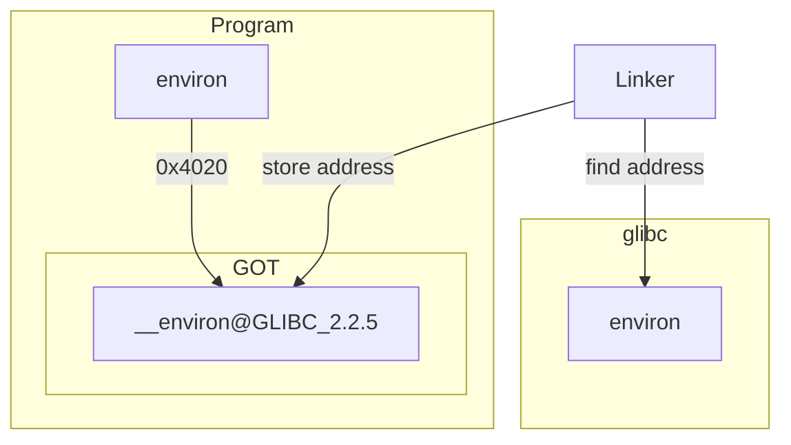
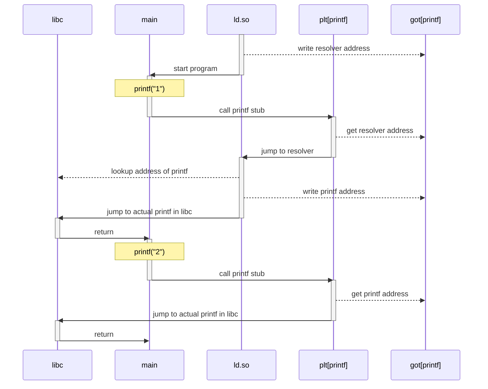

## Understanding Dynamic Linking on Linux
At its core, CVE-2024-3094 was an attack on dynamic linking. The same
thing could happen to any networked application which depends on
3rd-party dynamic libraries. To understand this attack, you need to know
a bit about how dynamic linking typically works on Linux.

Linking is not just something that happens at compile time. When your
program is executed, functions and variables can be imported from
*dynamic libraries*. This happens before your program's `main` function
is called, and is handled automatically for you by a tool called
[`ld.so(8)`][kerrisk]. This process is called *dynamic linking*.

To understand how dynamic linking works, and the role it played in
CVE-2024-3094, we'll need to talk two parts of a binary that make it
work: the [Global Offset Table](#global-offset-table) and the [Procedure
Linkage Table](#procedure-linkage-table).


### Global Offset Table
Before we look at how functions are loaded, let's take a look at how
variables are loaded from shared libraries.

The [`environ.c`](code/environ.c) file shows an example of an *extern*
variable in C. This is a variable whose value we expect to be provided
by a shared library at runtime; it is not the responsibility of our
program to create or initialize it.

When gcc sees an extern declaration like this:

```c
extern char **environ;
```

it prepares an entry for it in the binary's Global Offset Table (GOT).
When your program is loaded into memory, it is the responsibility of the
dynamic linker (`ld.so`) to find the address of the `environ` variable
and write it into the GOT.

This means that a program does not need to know the exact address of
extern variables; it simply needs to know where their address *will* be
located once the linker finds it. Each extern variable gets its own
entry in the GOT where the dynamic linker can store this address once
the correct symbol has been found.

If you run `make environ.got` you can see the entries that the compiler
has created for the `environ.c` program:

```console
$ make environ.got
gcc -o environ.exe code/environ.c
objdump -R environ.exe

environ.exe:     file format elf64-x86-64

DYNAMIC RELOCATION RECORDS
OFFSET           TYPE              VALUE
0000000000003dd0 R_X86_64_RELATIVE  *ABS*+0x0000000000001130
0000000000003dd8 R_X86_64_RELATIVE  *ABS*+0x00000000000010f0
0000000000004010 R_X86_64_RELATIVE  *ABS*+0x0000000000004010
0000000000003fc0 R_X86_64_GLOB_DAT  __libc_start_main@GLIBC_2.34
0000000000003fc8 R_X86_64_GLOB_DAT  _ITM_deregisterTMCloneTable@Base
0000000000003fd0 R_X86_64_GLOB_DAT  __gmon_start__@Base
0000000000003fd8 R_X86_64_GLOB_DAT  _ITM_registerTMCloneTable@Base
0000000000003fe0 R_X86_64_GLOB_DAT  __cxa_finalize@GLIBC_2.2.5
0000000000004020 R_X86_64_COPY     __environ@GLIBC_2.2.5
0000000000004000 R_X86_64_JUMP_SLOT  printf@GLIBC_2.2.5
```

If you look near the bottom, you can see that there is an entry called
`__environ@GLIBC_2.2.5`. When the program is loaded into memory, `ld.so`
will try to find this variable in [The GNU C Library][glibc] and place
its address into the GOT. Every part of the program that needs to access
`environ` will do so by using its *offset*. In this case, 0x4020.

Here's what the whole ball of wax looks like if we try to draw it out:



This indirection is part of what allows programs to work without
necessarily knowing where all of their symbols are ahead of time.


### Procedure Linkage Table
The Procedure Linking Table (PLT) uses the GOT to help programs to
invoke dynamic functions. But it is not a table in the same sense;
rather, the PLT is a set of stub functions, one for each dynamic
function in your application.

Each of these stub functions, when called, will simply jump to the
address listed in the corresponding GOT entry. So if your program calls
`printf`, there will be a GOT entry for the address of `printf` inside
the C library, and a PLT stub function which calls this address.

The reason for all this indirection is *lazy-binding*: the actual
address of the dynamic function is not resolved until the first time
that your program invokes it. This can save time at startup if your
application has a large amount of dynamic symbols.

Consider this program which calls `printf` three times:

```c
#include <stdio.h>

int main() {
	printf("1");
	printf("2");
	return 0;
}
```

Here's how this program and the linker work together (throught the PLT
and the GOT) to ensure that the address of `printf` only has to be
resolved once:



#### Viewing the PLT
As an example, take a look at [`hello_world.c`](code/hello_world.c).
This is a simple "Hello World"-style program that calls `printf(3)` to
print the name of the running program. Because printf itself is not
defined in your program, you'll need to import a suitable definition
from a dynamic library.

If you run `make hello_world.dylibs`, you can see the list of dynamic
libraries that your program will need to have in order to start up
correctly:

```console
$ make hello_world.dylibs
gcc -o hello_world.exe code/hello_world.c
objdump -p hello_world.exe | grep NEEDED
  NEEDED               libc.so.6
```

This tells us that our program wants to import a dynamic library called
"libc". For most Linux distros, this is [The GNU C Library][glibc].

For every dynamic function that your program needs to import, the
compiler will create a "stub" function in the Procedure
Linkage Table (PLT). 


### RELRO


Updating the GOT at runtime means that the memory page containing the
GOT must always be writable. This isn't ideal from a security
perspective.  An attacker who can inject a malicious payload into the
program may be able to overwrite values in the GOT, giving them some
control over how the program behaves. To prevent this, GCC introduced an
option called [Relocation Read-only][sidhpurwala] or "RELRO".

RELRO comes in two flavors: Full and Partial. Partial RELRO tells the
dynamic linker to do the following:

* Resolve GOT entries for all `extern` variables
* Mark these entries read-only by calling [`mprotect(2)`][mprotect]
* Call the program's `main` function

Full RELRO tells the dynamic linker to resolve *all* symbols before a
program begins executing, even functions.

You can check what (if any) degree of RELRO is enabled by running
[checksec(1)][checksec]. For example, we can inspect the
`plt_example.exe` binary like so:

```console
$ make plt_example.exe
$ checksec --file=./plt_example.exe
RELRO           STACK CANARY      NX            PIE             RPATH      RUNPATH      Symbols         FORTIFY Fortified       Fortifiable     FILE
Partial RELRO   No canary found   NX enabled    No PIE          No RPATH   No RUNPATH   36 Symbols        No    0               0               ./plt_example.exe
```

[checksec]: https://man.archlinux.org/man/checksec.1.en
[glibc]: https://www.gnu.org/software/libc/
[kerrisk]: https://www.man7.org/linux/man-pages/man8/ld.so.8.html
[mprotect]: https://www.man7.org/linux/man-pages/man2/mprotect.2.html
[sidhpurwala]: https://www.redhat.com/en/blog/hardening-elf-binaries-using-relocation-read-only-relro
