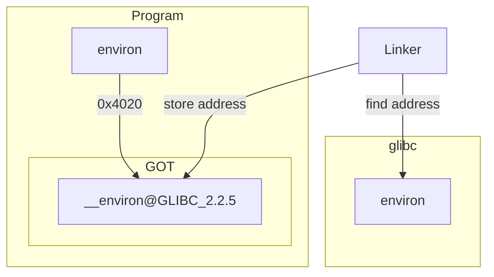
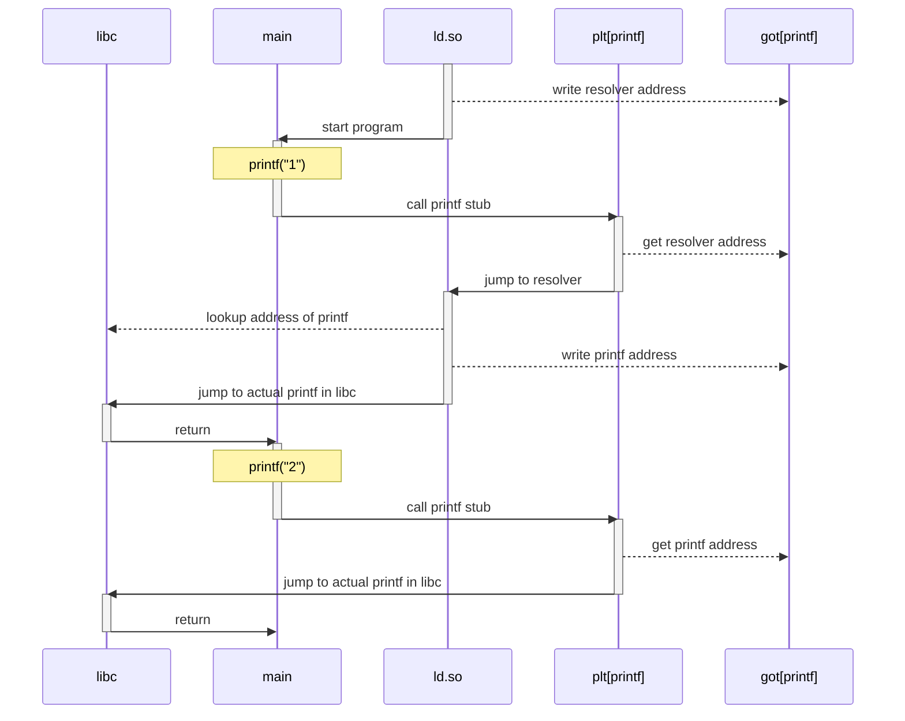

# Understanding Dynamic Linking on Linux
At its core, CVE-2024-3094 was an attack on dynamic linking. The same
thing could happen to any networked application which depends on
3rd-party dynamic libraries. To understand this attack, you need to know
a bit about how dynamic linking typically works on Linux.

Linking is not just something that happens at compile time. When your
program is executed, functions and variables can be imported from
*dynamic libraries*. This happens before your program's `main` function
is called, and is handled automatically for you by a tool called
[`ld.so(8)`][kerrisk]. This process is called *dynamic linking*.

As an example, take a look at [`hello_world.c`](code/hello_world.c):

```c
int main(int argc, char** argv) {
    printf("Hello from %s!\n", argv[0]);
    return 0;
}
```

This is a simple "Hello World"-style program that calls `printf` to
print the name of the running program. Because printf itself is not
defined in your program, the linker will need to import a suitable
definition from a dynamic library when your program starts up. But how
will the linker know which library to use?

Fortunately, the compiler stores information about which dynamic
libraries are needed *in the binary itself*. You can use the
[objdump(1)][objdump] command to see a list of dynamic libraries that
your program will need in order to start up correctly. Simply compile
the program and the run `objdump -p`:

```console
$ make hello_world.exe
gcc -o hello_world.exe code/hello_world.c
$ objdump -p hello_world.exe | grep NEEDED
  NEEDED               libc.so.6
```

This tells `ld.so` that our program wants to import a dynamic library called
"libc". For most Linux distros, this is [The GNU C Library][glibc]. In
order to see where `ld.so` expects to find this library, you can use the
[`ldd(1)`][ldd] command:

```console
$ ldd hello_world.exe
        linux-vdso.so.1 (0x00007ffd56350000)
        libc.so.6 => /lib/x86_64-linux-gnu/libc.so.6
(0x00007f6de4c42000)
        /lib64/ld-linux-x86-64.so.2 (0x00007f6de4e2f000)
```

(`ldd` can be handy for debugging dependency resolution issues, but
be careful using it on binaries that you don't trust: it allows
binaries to execute [arbitrary code][catonmat] to determine what
libraries they need)

To understand the role that dynamic linking played in CVE-2024-3094,
we'll need to talk two parts of a binary that make it work: the [Global
Offset Table](#the-global-offset-table) and the [Procedure Linkage
Table](#the-procedure-linkage-table).


## The Global Offset Table
Before we look at how functions are loaded, let's take a look at how
variables are loaded from shared libraries.

The [`environ.c`](code/environ.c) file shows an example of an *extern*
variable in C:

```c
extern char **environ;

int main() {
    printf("Address of environ: %p\n", (void*)&environ);
    printf("First environment variable: %s\n", environ[0]);
    return 0;
}
```


This is a variable whose value we expect to be provided
by a shared library at runtime; it is not the responsibility of our
program to create or initialize it.

When gcc sees an extern declaration like `extern char **environ;`, it
prepares an entry for it in the binary's Global Offset Table (GOT).
When your program is loaded into memory, it is the responsibility of the
dynamic linker (`ld.so`) to find the address of the `environ` variable
and write it into the GOT.

This means that a program does not need to know the exact address of
extern variables; it simply needs to know where their address *will* be
located once the linker finds it. Each extern variable gets its own
entry in the GOT where the dynamic linker can store this address once
the correct symbol has been found.

If you compile `environ.c` and run `objdump`, you can see the entries
that the compiler has creates for this program:

```console
$ make environ.exe
gcc -o environ.exe code/environ.c
$ objdump -R environ.exe

environ.exe:     file format elf64-x86-64

DYNAMIC RELOCATION RECORDS
OFFSET           TYPE              VALUE
0000000000003dd0 R_X86_64_RELATIVE  *ABS*+0x0000000000001130
0000000000003dd8 R_X86_64_RELATIVE  *ABS*+0x00000000000010f0
0000000000004010 R_X86_64_RELATIVE  *ABS*+0x0000000000004010
0000000000003fc0 R_X86_64_GLOB_DAT  __libc_start_main@GLIBC_2.34
0000000000003fc8 R_X86_64_GLOB_DAT  _ITM_deregisterTMCloneTable@Base
0000000000003fd0 R_X86_64_GLOB_DAT  __gmon_start__@Base
0000000000003fd8 R_X86_64_GLOB_DAT  _ITM_registerTMCloneTable@Base
0000000000003fe0 R_X86_64_GLOB_DAT  __cxa_finalize@GLIBC_2.2.5
0000000000004020 R_X86_64_COPY     __environ@GLIBC_2.2.5
0000000000004000 R_X86_64_JUMP_SLOT  printf@GLIBC_2.2.5
```

If you look near the bottom, you can see that there is an entry called
`__environ@GLIBC_2.2.5`. When the program is loaded into memory, `ld.so`
will try to find this variable in [The GNU C Library][glibc] and place
its address into the GOT. Every part of the program that needs to access
`environ` will do so by using its *offset*. In this case, 0x4020.

Here's what the whole ball of wax looks like:



This indirection is part of what allows programs to work without
necessarily knowing where all of their symbols are ahead of time.


## The Procedure Linkage Table
The Procedure Linking Table (PLT) uses the GOT to help programs invoke
dynamic functions. But it is not a table in the same sense; rather, the
PLT is a set of stub functions, one for each dynamic function in your
application.

Each of these stub functions, when called, will simply jump to the
address listed in the corresponding GOT entry. So if your program calls
`printf`, there will be a GOT entry for the address of `printf` inside
the C library, and a PLT stub function which calls this address.

The reason for all this indirection is *lazy-binding*: the actual
address of the dynamic function is not resolved until the first time
that your program invokes it. This can save time at startup if your
application has a large amount of dynamic symbols.

Consider this program which calls `printf` twice:

```c
#include <stdio.h>

int main() {
	printf("1");
	printf("2");
	return 0;
}
```

Here's how this program and the linker work together (throught the PLT
and the GOT) to ensure that the address of `printf` only has to be
resolved once:



### Viewing the PLT
You can use [objdump(1)][objdump] to inspect the PLT entries of any
binary. Take a look at [`plt_example.c`](code/plt_example.c):

```c
int main() {
    const char *message = "Hello, World!\n";
    size_t len = strlen(message); // Here's one

    write(0, message, len); // Here's another
    exit(0); // And here's the last one
    return 0;
}
```

This program uses three different dynamic functions: `strlen(3)`,
`write(2)`, and `exit(3)`. If we compile and then disassemble this
program, we'll be able to see what the PLT entries look like for each of
these functions:

```console
$ make plt_example.plt
gcc -fPIC -no-pie -o plt_example.exe code/plt_example.c
objdump -d -r plt_example.exe \
        | awk '/section/ { plt=0 }; /section .plt/ { plt=1 }; { if (plt) { print } }'
Disassembly of section .plt:

0000000000401020 <write@plt-0x10>:
  401020:       ff 35 ca 2f 00 00       push   0x2fca(%rip)        # 403ff0 <_GLOBAL_OFFSET_TABLE_+0x8>
  401026:       ff 25 cc 2f 00 00       jmp    *0x2fcc(%rip)        # 403ff8 <_GLOBAL_OFFSET_TABLE_+0x10>
  40102c:       0f 1f 40 00             nopl   0x0(%rax)

0000000000401030 <write@plt>:
  401030:       ff 25 ca 2f 00 00       jmp    *0x2fca(%rip)        # 404000 <write@GLIBC_2.2.5>
  401036:       68 00 00 00 00          push   $0x0
  40103b:       e9 e0 ff ff ff          jmp    401020 <_init+0x20>

0000000000401040 <strlen@plt>:
  401040:       ff 25 c2 2f 00 00       jmp    *0x2fc2(%rip)        # 404008 <strlen@GLIBC_2.2.5>
  401046:       68 01 00 00 00          push   $0x1
  40104b:       e9 d0 ff ff ff          jmp    401020 <_init+0x20>

0000000000401050 <exit@plt>:
  401050:       ff 25 ba 2f 00 00       jmp    *0x2fba(%rip)        # 404010 <exit@GLIBC_2.2.5>
  401056:       68 02 00 00 00          push   $0x2
  40105b:       e9 c0 ff ff ff          jmp    401020 <_init+0x20>
```

The compiler created four PLT entries:

* `<write@plt-0x10>`: This is used by the other PLT entries to call
  resolver logic from `ld.so`
* `<write@plt>`: This is a stub for `write(2)`
* `<strlen@plt>`: This is a stub for `strlen(3)`
* `<exit@plt>`: This is a stub for `exit(3)`

You can see that these entries are all very simple: they
try to jump to whatever address is stored in their corresponding GOT
entry. If that fails (if the jump address is actually just the current
address), then they push an identifier onto the stack and jump into the
resolver function itself (via `<write@plt-0x10>`).

Each dynamic function has its own identifier: look at the push
statements for the last three PLT entries and you'll see that they all
push different values. These values identify the row in the GOT where
the addresses of the actual dynamic functions will be stored, once
`ld.so` has resolved them.


## RELRO


Updating the GOT at runtime means that the memory page containing the
GOT must be writable. This isn't ideal from a security perspective.  An
attacker who can inject a malicious payload into the program may be able
to overwrite values in the GOT, giving them some control over how the
program behaves. In fact, [this is exactly what happened in
CVE-2024-3094][binarly-io].

To prevent this, GCC introduced an option called [Relocation
Read-only][sidhpurwala] or "RELRO".  RELRO comes in two flavors: Full
and Partial. Partial RELRO tells the dynamic linker to do the following:

* Resolve GOT entries for all `extern` variables
* Mark these entries read-only by calling [`mprotect(2)`][mprotect]
* Call the program's `main` function

Full RELRO tells the dynamic linker to resolve *all* symbols before a
program begins executing, even functions.

You can check what (if any) degree of RELRO is enabled by running
[checksec(1)][checksec]. For example, we can inspect the
`plt_example.exe` binary like so:

```console
$ make plt_example.exe
$ checksec --file=./plt_example.exe
RELRO           STACK CANARY      NX            PIE             RPATH      RUNPATH      Symbols         FORTIFY Fortified       Fortifiable     FILE
Partial RELRO   No canary found   NX enabled    No PIE          No RPATH   No RUNPATH   36 Symbols        No    0               0               ./plt_example.exe
```

The tie-in for CVE-2024-3094 is that if *any* level of RELRO is enabled,
all IFUNCs will be resolved before `main` is called. So, we lose all the
startup performance benefits of lazy bindings, and (as we now know),
malicious IFUNC logic could upend RELRO anyhow.

[binarly-io]: https://github.com/binarly-io/binary-risk-intelligence/tree/master/xz-backdoor
[catonmat]: https://catonmat.net/ldd-arbitrary-code-execution
[checksec]: https://man.archlinux.org/man/checksec.1.en
[glibc]: https://www.gnu.org/software/libc/
[kerrisk]: https://www.man7.org/linux/man-pages/man8/ld.so.8.html
[ldd]: https://www.man7.org/linux/man-pages/man1/ldd.1.html
[mprotect]: https://www.man7.org/linux/man-pages/man2/mprotect.2.html
[objdump]: https://www.man7.org/linux/man-pages/man1/objdump.1.html
[sidhpurwala]: https://www.redhat.com/en/blog/hardening-elf-binaries-using-relocation-read-only-relro
